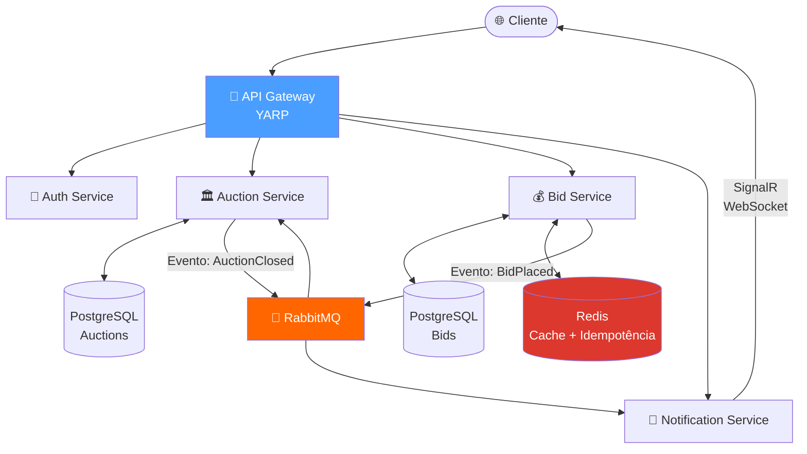
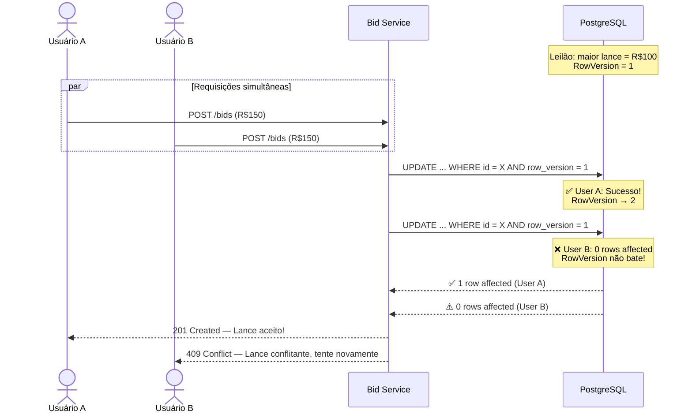
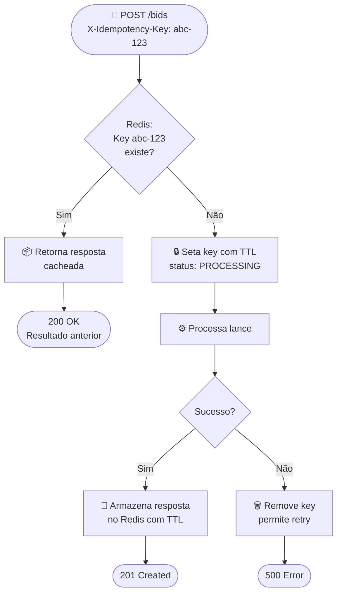
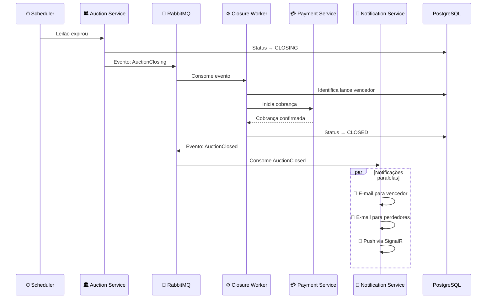
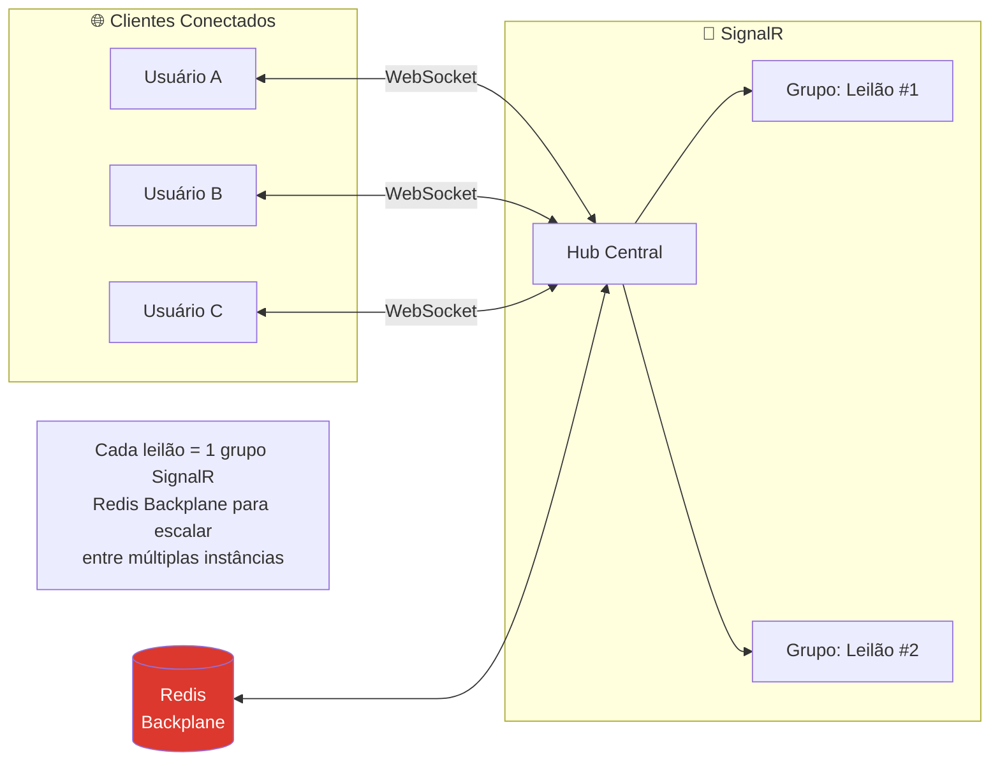
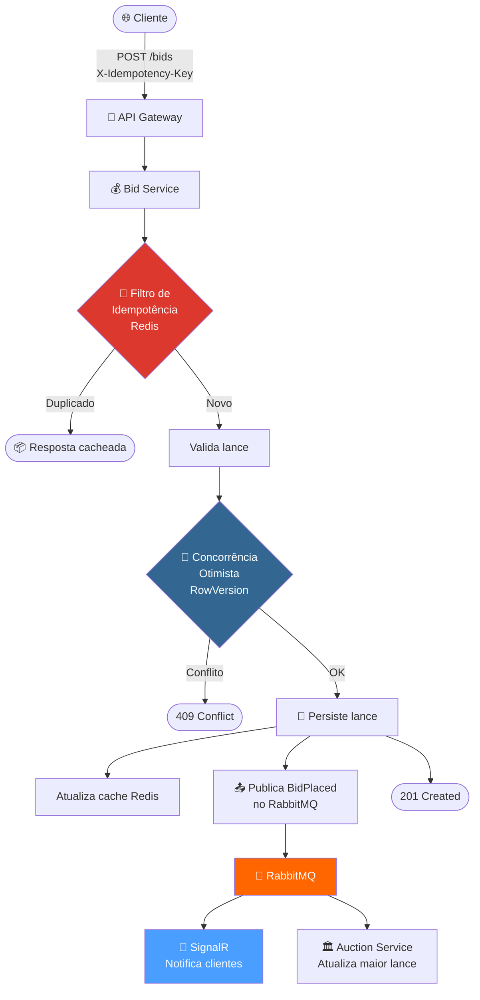

# Sistema de Leilão Distribuído

> Microsserviços, cache, idempotência, concorrência pesada e comunicação em tempo real — tudo o que um sistema de produção real exige quando **milissegundos importam**.

---

## Por que isso NÃO é CRUD?

Este sistema **parece** ter entidades (Leilão, Lance, Usuário), mas o diferencial está nos **problemas de infraestrutura distribuída** que ele resolve:

| CRUD típico | Este projeto |
|---|---|
| `POST /bids` e pronto | Controle de concorrência otimista com RowVersion |
| Sem preocupação com duplicatas | Idempotência distribuída por chave única |
| Tudo síncrono | Processamento via filas + workers |
| Polling para atualizar | Real-time via WebSockets |

**Mensagem:** _"Eu construo sistemas que escalam sob pressão real."_

---

## Stack

| Camada | Tecnologia |
|---|---|
| Runtime |  .NET 9 (Microsserviços) |
| Banco relacional |  PostgreSQL |
| Cache distribuído |  Redis |
| Message Broker |  RabbitMQ |
| Real-time | SignalR (WebSockets) |
| API Gateway | YARP (Reverse Proxy) |
| Containerização |  Docker / Docker Compose |
| Testes |  xUnit + Testcontainers |

---

## Arquitetura de Microsserviços



---

## 1. Concorrência & Race Conditions 🏁

Num leilão, **milissegundos importam**. Para impedir que dois usuários registrem o mesmo lance simultaneamente:

### Controle de Concorrência Otimista com RowVersion

O PostgreSQL rejeita atualizações conflitantes no nível da transação, garantindo integridade **sem travar a tabela inteira**.



**Como funciona:**
1. Toda entidade de Leilão possui uma coluna `row_version` (`xmin` do PostgreSQL ou coluna explícita)
2. Ao registrar um lance, o `UPDATE` inclui `WHERE row_version = @expected`
3. Se outro lance chegou antes, o `row_version` já mudou → **0 rows affected**
4. O serviço detecta o conflito e retorna **409 Conflict**
5. O cliente pode re-tentar com o valor atualizado

---

## 2. Idempotência 🔄

Falhas de rede fazem requests serem **retransmitidos**. Sem idempotência, o mesmo lance poderia ser registrado **duas vezes**.

### Filtro de Idempotência Distribuído



**Mecanismo:**
1. O cliente envia um header `X-Idempotency-Key` único por operação
2. O **IdempotencyFilter** verifica no Redis se essa key já foi processada
3. Se sim → retorna a **resposta cacheada** (sem reprocessar)
4. Se não → **processa** e armazena o resultado com TTL
5. Se falhar → **remove a key** para permitir retry legítimo

---

## 3. Consistência Eventual & Resiliência 📉

Em vez de processar tudo na thread da requisição (bloqueando o usuário), operações pesadas são **descarregadas para workers** via RabbitMQ.

### Fluxo de Fechamento de Leilão



**Benefícios:**
- A API responde **instantaneamente** (não espera envio de e-mail)
- Se o envio de notificação falhar, o **retry automático** da fila cuida
- O fechamento do leilão é **atômico** no banco, **eventual** nas notificações

### Fluxo de Retry com Dead Letter Queue


---

## 4. Atualizações em Tempo Real 📡

**SignalR** empurra atualizações de lances para todos os clientes conectados **instantaneamente**. Sem "atualizar página". A UI atualiza o preço e notifica se você foi superado — em tempo real.


### Arquitetura do Hub SignalR



**Detalhes:**
- Cada leilão ativo é um **grupo SignalR** — só recebe updates quem está assistindo
- **Redis Backplane** sincroniza hubs entre múltiplas instâncias do serviço
- Fallback automático para **Long Polling** se WebSocket não estiver disponível

---

## Visão Geral — Fluxo Completo de um Lance



---

## Estrutura do Projeto

```
Leilao/
├── src/
│   ├── Gateway/                          # API Gateway (YARP)
│   │   └── Program.cs
│   │
│   ├── Services/
│   │   ├── Auth.API/                     # Autenticação e autorização
│   │   │   ├── Program.cs
│   │   │   └── Controllers/
│   │   │       └── AuthController.cs
│   │   │
│   │   ├── Auction.API/                  # Gestão de leilões
│   │   │   ├── Program.cs
│   │   │   ├── Controllers/
│   │   │   │   └── AuctionsController.cs
│   │   │   ├── Consumers/
│   │   │   │   └── BidPlacedConsumer.cs
│   │   │   └── Workers/
│   │   │       └── AuctionClosureWorker.cs
│   │   │
│   │   ├── Bid.API/                      # Registro de lances
│   │   │   ├── Program.cs
│   │   │   ├── Controllers/
│   │   │   │   └── BidsController.cs
│   │   │   ├── Filters/
│   │   │   │   └── IdempotencyFilter.cs
│   │   │   └── Hubs/
│   │   │       └── AuctionHub.cs
│   │   │
│   │   └── Notification.API/            # Notificações e e-mails
│   │       ├── Program.cs
│   │       └── Consumers/
│   │           ├── AuctionClosedConsumer.cs
│   │           └── BidPlacedConsumer.cs
│   │
│   ├── Shared/                           # Contratos e utilidades compartilhadas
│   │   ├── Contracts/
│   │   │   ├── Events/
│   │   │   │   ├── BidPlacedEvent.cs
│   │   │   │   └── AuctionClosedEvent.cs
│   │   │   └── DTOs/
│   │   └── Infrastructure/
│   │       ├── Idempotency/
│   │       │   └── IdempotencyKeyStore.cs
│   │       └── Messaging/
│   │           └── RabbitMqExtensions.cs
│   │
│   └── Domain/                           # Entidades e regras de negócio
│       ├── Entities/
│       │   ├── Auction.cs
│       │   ├── Bid.cs
│       │   └── User.cs
│       └── ValueObjects/
│           └── Money.cs
│
├── tests/
│   ├── Auction.UnitTests/
│   ├── Bid.UnitTests/
│   ├── Bid.IntegrationTests/
│   └── Architecture.Tests/              # Testes de dependência entre serviços
│
├── docker-compose.yml
├── docker-compose.override.yml
└── README.md
```

---

## Como Rodar

```bash
# Subir toda a infraestrutura + serviços
docker-compose up -d

# Ou rodar serviços individualmente
dotnet run --project src/Gateway
dotnet run --project src/Services/Auction.API
dotnet run --project src/Services/Bid.API
dotnet run --project src/Services/Notification.API

# Executar testes
dotnet test
```

---

## Configuração

```json
{
  "Gateway": {
    "Routes": {
      "/api/auctions": "http://auction-service:5001",
      "/api/bids": "http://bid-service:5002",
      "/api/auth": "http://auth-service:5003"
    }
  },
  "RabbitMq": {
    "Host": "rabbitmq",
    "Port": 5672,
    "Exchanges": {
      "Bids": "bids-exchange",
      "Auctions": "auctions-exchange"
    }
  },
  "Redis": {
    "ConnectionString": "redis:6379",
    "IdempotencyTtlMinutes": 60,
    "SignalRBackplane": true
  },
  "PostgreSQL": {
    "AuctionDb": "Host=postgres;Database=auctions;...",
    "BidDb": "Host=postgres;Database=bids;..."
  }
}
```

---

## Resumo dos Desafios Técnicos

| # | Desafio | Solução | Tecnologia chave |
|---|---|---|---|
| 🏁 | Concorrência | Controle Otimista com RowVersion | PostgreSQL |
| 🔄 | Idempotência | Filtro com chave única distribuída | Redis |
| 📉 | Consistência Eventual | Workers assíncronos com retry | RabbitMQ |
| 📡 | Tempo Real | Push bidirecional com grupos | SignalR + Redis Backplane |
