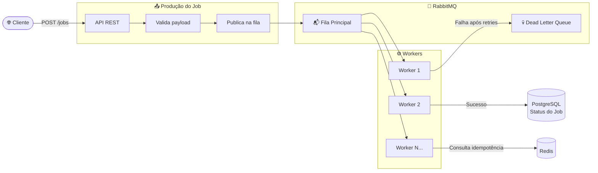
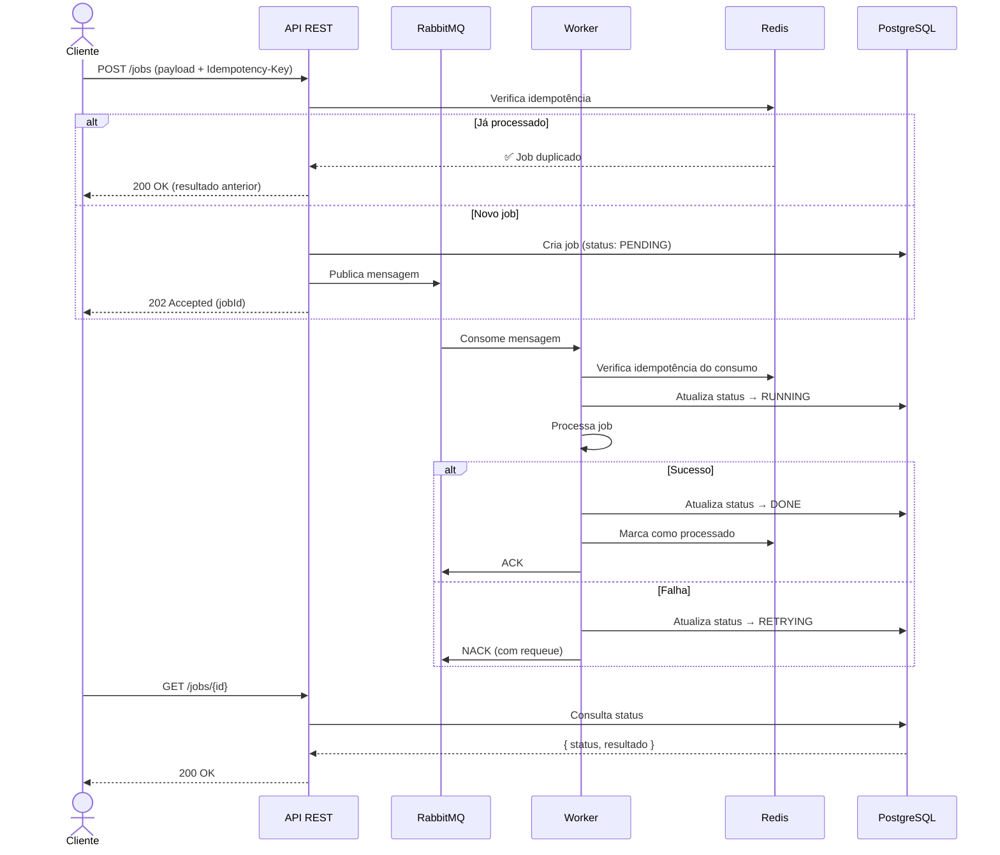
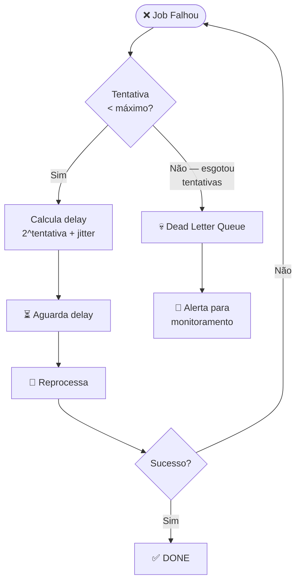
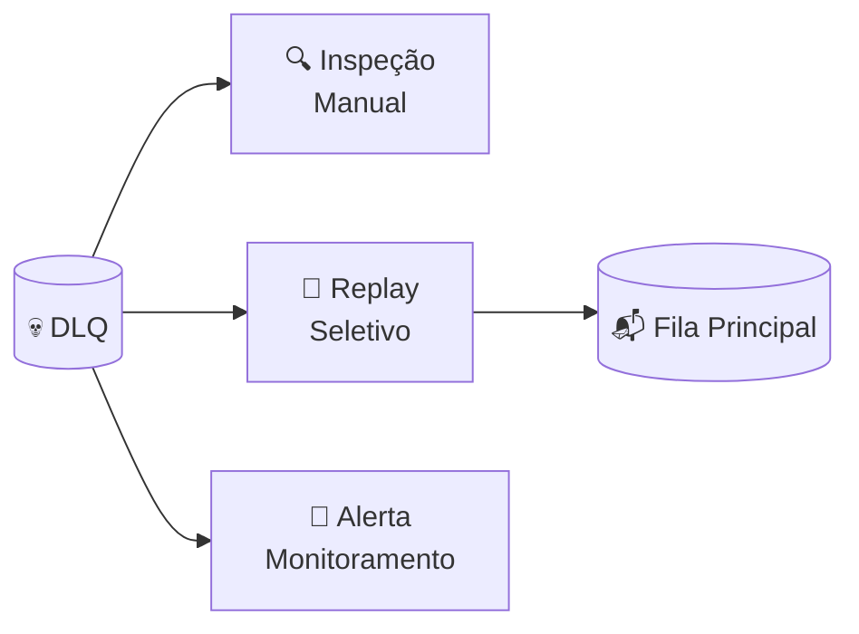
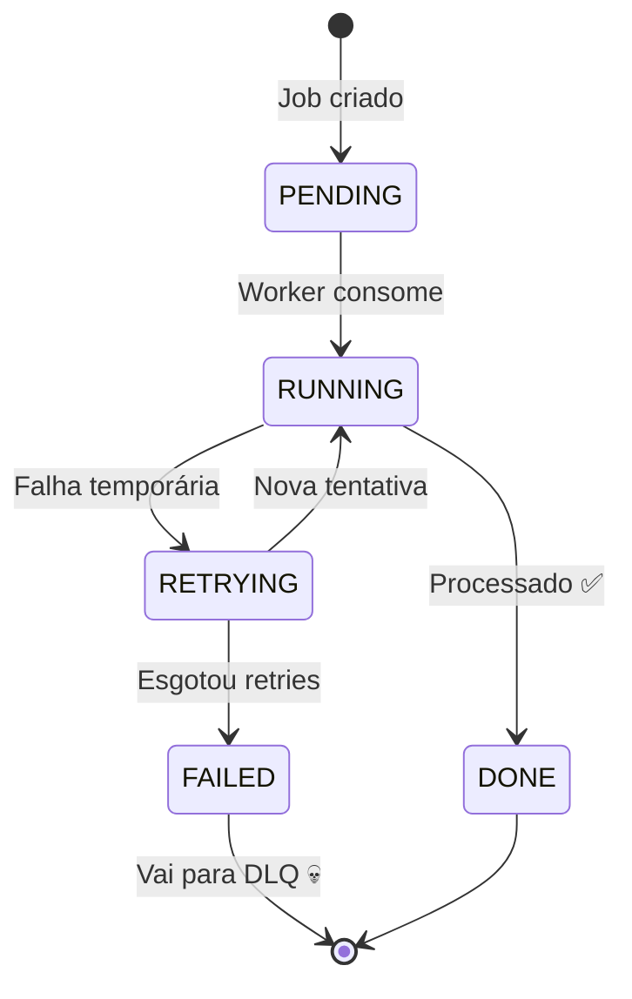

# Sistema de Processamento Assíncrono de Jobs

> Processamento em background com filas, workers, retry inteligente e Dead Letter Queue — o core é **fluxo e estado**, não dados.

---

## Por que isso NÃO é CRUD?

| CRUD típico | Este projeto |
|---|---|
| Dados no centro | Fluxo e estado no centro |
| Request → Response síncrono | Fire-and-forget assíncrono |
| Banco como protagonista | Fila como protagonista |

**Mensagem:** _"Sei lidar com sistemas que quebram."_

---

## Stack

| Camada | Tecnologia |
|---|---|
| Runtime |  .NET 9 |
| Message Broker |  RabbitMQ |
| Cache / Idempotência |  Redis |
| Banco (status dos jobs) |  PostgreSQL |
| Containerização |  Docker / Docker Compose |
| Testes |  xUnit + Testcontainers |

---

## Arquitetura Geral



---

## Fluxo Completo de um Job



---

## Retry com Exponential Backoff

Quando um job falha, não reprocessamos imediatamente — isso sobrecarregaria o sistema. Usamos **exponential backoff** com jitter.



| Tentativa | Delay base | Com jitter (exemplo) |
|---|---|---|
| 1 | 2s | 2.3s |
| 2 | 4s | 4.7s |
| 3 | 8s | 7.1s |
| 4 | 16s | 18.2s |
| 5 (máx) | — | → DLQ |

---

## Dead Letter Queue (DLQ)

Jobs que **esgotaram todas as tentativas** caem na DLQ. Eles não desaparecem — ficam disponíveis para:

- Inspeção manual
- Reprocessamento seletivo
- Geração de alertas



---

## Idempotência no Consumo

A rede não é confiável. Uma mensagem pode ser entregue **mais de uma vez**. Para garantir que o mesmo job não seja executado duas vezes:


---

## Ciclo de Vida de um Job



---

## Casos de Uso Implementados

| Caso | Descrição |
|---|---|
| 📄 **Upload de CSV** | Usuário envia arquivo → sistema processa linhas em background |
| 📊 **Geração de Relatório** | Requisição dispara job pesado → resultado disponível via polling |
| 📧 **Envio Massivo de Notificações** | Enfileira milhares de e-mails sem bloquear a API |

---

## Estrutura do Projeto

```
Processamento_async/
├── src/
│   ├── Jobs.API/                      # API REST — recebe e consulta jobs
│   │   ├── Program.cs
│   │   ├── Controllers/
│   │   │   └── JobsController.cs
│   │   └── Filters/
│   │       └── IdempotencyFilter.cs
│   ├── Jobs.Core/                     # Domínio e interfaces
│   │   ├── Models/
│   │   │   ├── Job.cs
│   │   │   └── JobStatus.cs
│   │   ├── Interfaces/
│   │   │   ├── IJobProcessor.cs
│   │   │   └── IMessageBroker.cs
│   │   └── Strategies/
│   │       └── RetryStrategy.cs
│   ├── Jobs.Worker/                   # Consumer — processa jobs da fila
│   │   ├── Program.cs
│   │   └── Consumers/
│   │       ├── CsvProcessorConsumer.cs
│   │       ├── ReportGeneratorConsumer.cs
│   │       └── NotificationConsumer.cs
│   └── Jobs.Infrastructure/           # RabbitMQ, Redis, PostgreSQL
│       ├── Messaging/
│       │   └── RabbitMqBroker.cs
│       ├── Cache/
│       │   └── RedisIdempotencyStore.cs
│       └── Persistence/
│           └── JobRepository.cs
├── tests/
│   ├── Jobs.UnitTests/
│   └── Jobs.IntegrationTests/
├── docker-compose.yml
└── README.md
```

---

## Como Rodar

```bash
# Subir infraestrutura (RabbitMQ, Redis, PostgreSQL)
docker-compose up -d

# Rodar a API
dotnet run --project src/Jobs.API

# Rodar o Worker (em outro terminal)
dotnet run --project src/Jobs.Worker

# Executar testes
dotnet test
```

---

## Configuração

```json
{
  "RabbitMq": {
    "Host": "localhost",
    "Port": 5672,
    "Username": "guest",
    "Password": "guest",
    "Queues": {
      "Main": "jobs-queue",
      "DeadLetter": "jobs-dlq"
    }
  },
  "Retry": {
    "MaxAttempts": 5,
    "BaseDelaySeconds": 2,
    "UseJitter": true
  },
  "Redis": {
    "ConnectionString": "localhost:6379",
    "IdempotencyTtlMinutes": 60
  }
}
```

---

## Observabilidade

| O quê | Como |
|---|---|
| Logs estruturados | Serilog com correlation ID por job |
| Métricas | Jobs processados, falhos, tempo médio de processamento |
| Alertas | Jobs na DLQ disparam notificação |
| Dashboard | RabbitMQ Management UI (`localhost:15672`) |
