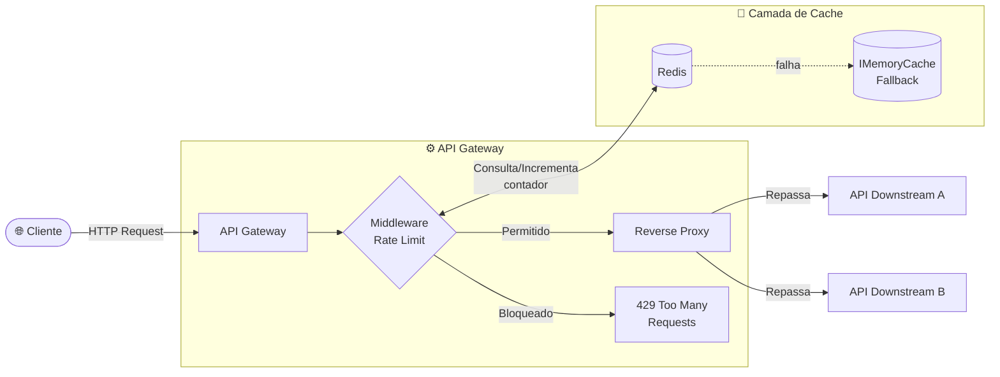
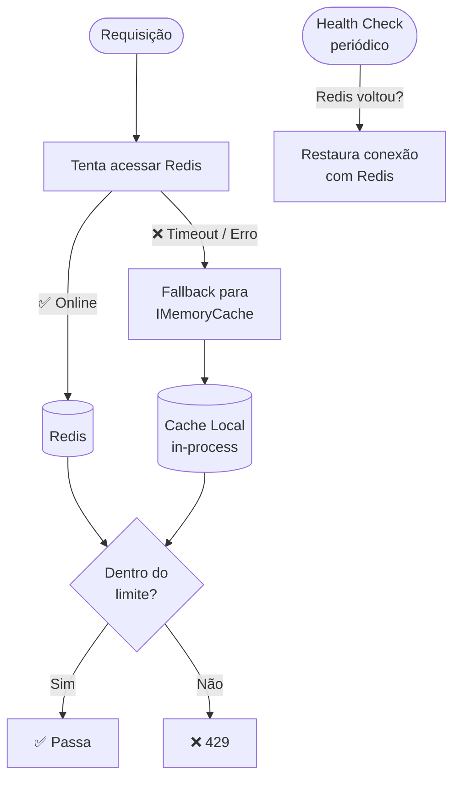

# Rate Limiter + API Gateway Simplificado

> Um serviço que fica **na frente** de outras APIs, protegendo-as contra abuso, sobrecarga e requisições mal-intencionadas — sem banco de dados, sem CRUD.

---

## Por que isso NÃO é CRUD?

| CRUD típico | Este projeto |
|---|---|
| Entidades persistentes (User, Product…) | Sem entidade persistente |
| Listar / Criar / Editar / Deletar | Algoritmo + Infraestrutura |
| Banco relacional como centro | Cache em memória como centro |

**Mensagem:** _"Eu penso em proteção de sistema, não em telinha."_

---

## Stack

| Camada | Tecnologia |
|---|---|
| Runtime |  .NET 9 (Minimal API) |
| Cache distribuído |  Redis |
| Cache local (fallback) | `IMemoryCache` (in-process) |
| Containerização |  Docker / Docker Compose |
| Testes |  xUnit + Testcontainers |

---

## Arquitetura Geral



---

## Algoritmo de Rate Limiting

### Token Bucket

O algoritmo escolhido é o **Token Bucket** — simples, eficiente e amplamente usado em produção (AWS, Cloudflare, Kong).


**Como funciona:**
1. Cada IP/token recebe um **bucket** com capacidade máxima de `N` tokens
2. Cada requisição **consome 1 token**
3. Tokens são **reabastecidos** a uma taxa fixa (ex: 10 tokens/segundo)
4. Se o bucket estiver vazio → **429 Too Many Requests**

---

## Headers Customizados

Toda resposta inclui headers de rate limit seguindo o padrão de mercado:

```
HTTP/1.1 200 OK
X-RateLimit-Limit: 100
X-RateLimit-Remaining: 73
X-RateLimit-Reset: 1672531200
Retry-After: 30          ← (apenas no 429)
```

---

## Fallback — Quando o Redis Cai



**Estratégia:**
- Health check periódico tenta reconectar ao Redis
- Enquanto o Redis estiver fora, o `IMemoryCache` assume com limites locais por instância
- Logs estruturados registram toda troca de provider

---

## Estrutura do Projeto

```
Rate_limiter_API_gateway/
├── src/
│   ├── Gateway.API/                  # Entry point — Minimal API
│   │   ├── Program.cs
│   │   ├── Middlewares/
│   │   │   └── RateLimitMiddleware.cs
│   │   └── Extensions/
│   │       └── ServiceCollectionExtensions.cs
│   ├── Gateway.Core/                 # Algoritmos e interfaces
│   │   ├── Interfaces/
│   │   │   └── IRateLimitStrategy.cs
│   │   ├── Strategies/
│   │   │   └── TokenBucketStrategy.cs
│   │   └── Models/
│   │       └── RateLimitResult.cs
│   └── Gateway.Infrastructure/       # Redis, fallback, proxy
│       ├── Cache/
│       │   ├── RedisCacheProvider.cs
│       │   └── InMemoryFallbackProvider.cs
│       └── Proxy/
│           └── ReverseProxyHandler.cs
├── tests/
│   ├── Gateway.UnitTests/
│   └── Gateway.IntegrationTests/
├── docker-compose.yml
└── README.md
```

---

## Como Rodar

```bash
# Subir a infraestrutura
docker-compose up -d

# Rodar a API
dotnet run --project src/Gateway.API

# Executar testes
dotnet test
```

---

## Configuração

```json
{
  "RateLimit": {
    "MaxTokens": 100,
    "RefillRate": 10,
    "RefillIntervalSeconds": 1,
    "KeyStrategy": "IP"
  },
  "Redis": {
    "ConnectionString": "localhost:6379",
    "FallbackToMemory": true,
    "HealthCheckIntervalSeconds": 5
  },
  "DownstreamApis": [
    { "Path": "/api/service-a", "Target": "http://localhost:5001" },
    { "Path": "/api/service-b", "Target": "http://localhost:5002" }
  ]
}
```
