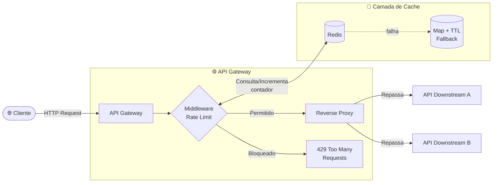
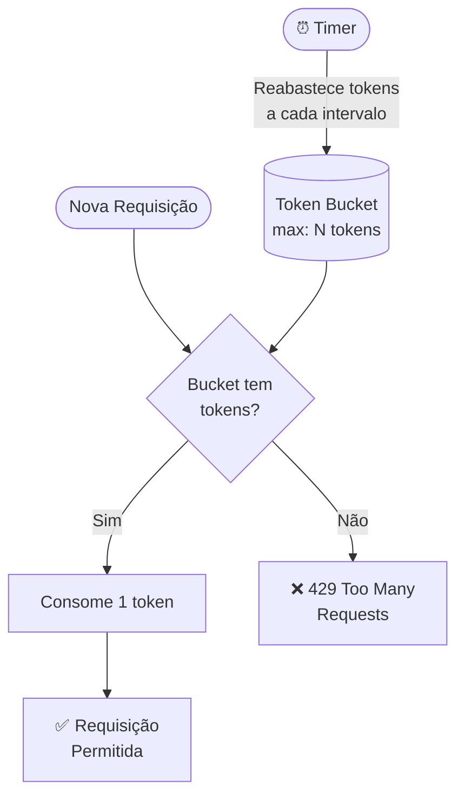

# Rate Limiter + API Gateway Simplificado

> Um serviço que fica **na frente** de outras APIs, protegendo-as contra abuso, sobrecarga e requisições mal-intencionadas — sem banco de dados, sem CRUD.

---

## Por que isso NÃO é CRUD?

| CRUD típico | Este projeto |
|---|---|
| Entidades persistentes (User, Product…) | Sem entidade persistente |
| Listar / Criar / Editar / Deletar | Algoritmo + Infraestrutura |
| Banco relacional como centro | Cache em memória como centro |

**Mensagem:** _"Eu penso em proteção de sistema, não em telinha."_

---

## Stack

| Camada | Tecnologia |
|---|---|
| Runtime | Node.js 20+ |
| Framework | NestJS + TypeScript |
| Cache distribuído | Redis |
| Cache local (fallback) | Node.js Map + TTL (in-process) |
| Proxy | http-proxy ou express-http-proxy |
| Containerização | Docker / Docker Compose |
| Testes | Jest + Testcontainers |

---

## Arquitetura Geral



---

## Algoritmo de Rate Limiting

### Token Bucket

O algoritmo escolhido é o **Token Bucket** — simples, eficiente e amplamente usado em produção (AWS, Cloudflare, Kong).



**Como funciona:**
1. Cada IP/token recebe um **bucket** com capacidade máxima de `N` tokens
2. Cada requisição **consome 1 token**
3. Tokens são **reabastecidos** a uma taxa fixa (ex: 10 tokens/segundo)
4. Se o bucket estiver vazio → **429 Too Many Requests**

---

## Headers Customizados

Toda resposta inclui headers de rate limit seguindo o padrão de mercado:

```
HTTP/1.1 200 OK
X-RateLimit-Limit: 100
X-RateLimit-Remaining: 73
X-RateLimit-Reset: 1672531200
Retry-After: 30          ← (apenas no 429)
```

---

## Fallback — Quando o Redis Cai


**Estratégia:**
- Health check periódico tenta reconectar ao Redis
- Enquanto o Redis estiver fora, o `Map` local assume com limites por instância
- Logs estruturados registram toda troca de provider

---

## Implementação: Token Bucket Strategy

```typescript
// token-bucket.strategy.ts
export interface TokenBucketConfig {
  maxTokens: number;
  refillRate: number; // tokens por segundo
}

export class TokenBucketStrategy {
  private buckets: Map<string, BucketState> = new Map();
  private refillInterval: NodeJS.Timer;

  constructor(private config: TokenBucketConfig) {
    // Reabastece tokens a cada 100ms
    this.refillInterval = setInterval(() => {
      this.refillAllBuckets();
    }, 100);
  }

  canConsume(key: string, tokensNeeded: number = 1): boolean {
    let bucket = this.buckets.get(key);

    if (!bucket) {
      bucket = {
        tokens: this.config.maxTokens,
        lastRefillTime: Date.now(),
      };
      this.buckets.set(key, bucket);
    }

    // Calcula quantos tokens foram adicionados desde a última refill
    const now = Date.now();
    const timePassed = (now - bucket.lastRefillTime) / 1000;
    const tokensToAdd = timePassed * this.config.refillRate;

    bucket.tokens = Math.min(
      this.config.maxTokens,
      bucket.tokens + tokensToAdd,
    );
    bucket.lastRefillTime = now;

    // Tenta consumir
    if (bucket.tokens >= tokensNeeded) {
      bucket.tokens -= tokensNeeded;
      return true;
    }

    return false;
  }

  getRemainingTokens(key: string): number {
    const bucket = this.buckets.get(key);
    if (!bucket) return this.config.maxTokens;

    const now = Date.now();
    const timePassed = (now - bucket.lastRefillTime) / 1000;
    const tokensToAdd = timePassed * this.config.refillRate;

    return Math.min(
      this.config.maxTokens,
      bucket.tokens + tokensToAdd,
    );
  }

  getResetTime(key: string): number {
    const bucket = this.buckets.get(key);
    if (!bucket) return Math.floor(Date.now() / 1000) + 1;

    const remainingTokens = this.getRemainingTokens(key);
    const tokensNeeded = this.config.maxTokens - remainingTokens;
    const secondsToFull = tokensNeeded / this.config.refillRate;

    return Math.ceil((Date.now() + secondsToFull * 1000) / 1000);
  }

  private refillAllBuckets(): void {
    const now = Date.now();

    for (const [key, bucket] of this.buckets.entries()) {
      const timePassed = (now - bucket.lastRefillTime) / 1000;
      const tokensToAdd = timePassed * this.config.refillRate;

      bucket.tokens = Math.min(
        this.config.maxTokens,
        bucket.tokens + tokensToAdd,
      );
      bucket.lastRefillTime = now;

      // Remove buckets inativos (sem acesso há 1 hora)
      if (now - bucket.lastRefillTime > 3600000) {
        this.buckets.delete(key);
      }
    }
  }

  destroy(): void {
    clearInterval(this.refillInterval);
  }
}

interface BucketState {
  tokens: number;
  lastRefillTime: number;
}
```

---

## Implementação: Rate Limit Guard

```typescript
// rate-limit.guard.ts
import { Injectable, CanActivate, ExecutionContext, HttpException, HttpStatus } from '@nestjs/common';
import { Request, Response } from 'express';
import { RateLimitService } from './rate-limit.service';

@Injectable()
export class RateLimitGuard implements CanActivate {
  constructor(private rateLimitService: RateLimitService) {}

  async canActivate(context: ExecutionContext): Promise<boolean> {
    const request = context.switchToHttp().getRequest<Request>();
    const response = context.switchToHttp().getResponse<Response>();

    // Extrai identificador: IP ou token de API
    const identifier = this.extractIdentifier(request);

    // Verifica rate limit
    const result = await this.rateLimitService.checkLimit(identifier);

    // Adiciona headers padrão
    response.set({
      'X-RateLimit-Limit': String(result.limit),
      'X-RateLimit-Remaining': String(result.remaining),
      'X-RateLimit-Reset': String(result.resetTime),
    });

    if (!result.allowed) {
      response.set({
        'Retry-After': String(result.retryAfter),
      });

      throw new HttpException(
        {
          statusCode: HttpStatus.TOO_MANY_REQUESTS,
          message: 'Too many requests, please try again later.',
          retryAfter: result.retryAfter,
        },
        HttpStatus.TOO_MANY_REQUESTS,
      );
    }

    return true;
  }

  private extractIdentifier(request: Request): string {
    // Tenta extrair do header de autorização
    const authHeader = request.headers.authorization;
    if (authHeader?.startsWith('Bearer ')) {
      return authHeader.substring(7);
    }

    // Fallback para IP
    return (
      request.headers['x-forwarded-for']?.toString().split(',')[0] ||
      request.socket.remoteAddress ||
      'unknown'
    );
  }
}
```

---

## Implementação: Rate Limit Service

```typescript
// rate-limit.service.ts
import { Injectable, Logger } from '@nestjs/common';
import { TokenBucketStrategy } from './strategies/token-bucket.strategy';
import { RedisService } from '../shared/redis/redis.service';

export interface RateLimitResult {
  allowed: boolean;
  limit: number;
  remaining: number;
  resetTime: number;
  retryAfter?: number;
}

@Injectable()
export class RateLimitService {
  private readonly logger = new Logger(RateLimitService.name);
  private tokenBucket: TokenBucketStrategy;
  private localFallback: Map<string, BucketState> = new Map();
  private redisHealth: boolean = true;
  private healthCheckInterval: NodeJS.Timer;

  constructor(private redis: RedisService) {
    this.tokenBucket = new TokenBucketStrategy({
      maxTokens: 100,
      refillRate: 10,
    });

    // Health check periódico
    this.healthCheckInterval = setInterval(() => {
      this.checkRedisHealth();
    }, 5000);
  }

  async checkLimit(identifier: string): Promise<RateLimitResult> {
    try {
      if (this.redisHealth) {
        return await this.checkLimitWithRedis(identifier);
      } else {
        return this.checkLimitWithFallback(identifier);
      }
    } catch (error) {
      this.logger.error(`Error checking rate limit for ${identifier}:`, error);
      this.redisHealth = false;
      return this.checkLimitWithFallback(identifier);
    }
  }

  private async checkLimitWithRedis(identifier: string): Promise<RateLimitResult> {
    const key = `rate-limit:${identifier}`;
    const limit = 100;

    // Tenta incrementar o contador com TTL
    const result = await this.redis.incr(key);

    if (result === 1) {
      // Primeira requisição — seta TTL de 1 segundo
      await this.redis.expire(key, 1);
    }

    const remaining = Math.max(0, limit - result);
    const allowed = result <= limit;
    const resetTime = Math.floor(Date.now() / 1000) + 1;

    return {
      allowed,
      limit,
      remaining,
      resetTime,
      retryAfter: allowed ? undefined : Math.ceil(remaining / 10),
    };
  }

  private checkLimitWithFallback(identifier: string): RateLimitResult {
    const limit = 100;
    let bucket = this.localFallback.get(identifier);

    if (!bucket || Date.now() > bucket.resetTime) {
      bucket = {
        count: 0,
        resetTime: Date.now() + 1000,
      };
      this.localFallback.set(identifier, bucket);
    }

    bucket.count++;
    const remaining = Math.max(0, limit - bucket.count);
    const allowed = bucket.count <= limit;

    return {
      allowed,
      limit,
      remaining,
      resetTime: Math.floor(bucket.resetTime / 1000),
      retryAfter: allowed ? undefined : 1,
    };
  }

  private async checkRedisHealth(): Promise<void> {
    try {
      await this.redis.ping();
      if (!this.redisHealth) {
        this.logger.log('Redis health check: RECOVERED');
        this.redisHealth = true;
      }
    } catch (error) {
      if (this.redisHealth) {
        this.logger.warn('Redis health check: FAILED, switching to fallback');
        this.redisHealth = false;
      }
    }
  }

  onModuleDestroy(): void {
    clearInterval(this.healthCheckInterval);
    this.tokenBucket.destroy();
  }
}

interface BucketState {
  count: number;
  resetTime: number;
}
```

---

## Implementação: API Gateway com Reverse Proxy

```typescript
// gateway.controller.ts
import { Controller, All, Req, Res, UseGuards } from '@nestjs/common';
import { Request, Response } from 'express';
import { createProxyMiddleware } from 'express-http-proxy';
import { RateLimitGuard } from './guards/rate-limit.guard';

@Controller()
export class GatewayController {
  // Mapeia rotas para serviços downstream
  private proxyMap: Map<string, any>;

  constructor() {
    this.proxyMap = new Map([
      ['/api/users', 'http://localhost:3001'],
      ['/api/products', 'http://localhost:3002'],
      ['/api/orders', 'http://localhost:3003'],
    ]);
  }

  @All('*')
  @UseGuards(RateLimitGuard)
  async proxy(@Req() req: Request, @Res() res: Response) {
    const path = req.path;

    // Encontra serviço correspondente
    let targetService: string | null = null;
    for (const [pattern, service] of this.proxyMap) {
      if (path.startsWith(pattern)) {
        targetService = service;
        break;
      }
    }

    if (!targetService) {
      return res.status(404).json({
        statusCode: 404,
        message: 'Service not found',
      });
    }

    // Cria middleware de proxy dinamicamente
    const proxy = createProxyMiddleware({
      target: targetService,
      changeOrigin: true,
      pathRewrite: (path) => path, // Preserva path original
      on: {
        proxyReq: (proxyReq, req) => {
          // Adiciona headers customizados
          proxyReq.setHeader('X-Forwarded-By', 'RateLimitGateway');
          proxyReq.setHeader('X-Original-IP', this.getClientIp(req));
        },
        error: (error) => {
          console.error('Proxy error:', error);
        },
      },
    });

    return proxy(req, res);
  }

  private getClientIp(req: Request): string {
    return (
      req.headers['x-forwarded-for']?.toString().split(',')[0] ||
      req.socket.remoteAddress ||
      'unknown'
    );
  }
}
```

---

## Implementação: Module

```typescript
// gateway.module.ts
import { Module } from '@nestjs/common';
import { HttpModule } from '@nestjs/axios';
import { GatewayController } from './gateway.controller';
import { RateLimitService } from './services/rate-limit.service';
import { RateLimitGuard } from './guards/rate-limit.guard';
import { RedisService } from '../shared/redis/redis.service';

@Module({
  imports: [HttpModule],
  controllers: [GatewayController],
  providers: [
    RateLimitService,
    RateLimitGuard,
    RedisService,
  ],
})
export class GatewayModule {}
```

---

## Estrutura do Projeto

```
rate-limiter-gateway/
├── src/
│   ├── gateway/                       # API Gateway + Rate Limiter
│   │   ├── gateway.controller.ts
│   │   ├── gateway.module.ts
│   │   ├── services/
│   │   │   └── rate-limit.service.ts
│   │   ├── guards/
│   │   │   └── rate-limit.guard.ts
│   │   ├── strategies/
│   │   │   └── token-bucket.strategy.ts
│   │   └── interfaces/
│   │       └── rate-limit.interface.ts
│   │
│   ├── shared/
│   │   ├── redis/
│   │   │   └── redis.service.ts
│   │   └── config/
│   │       └── gateway.config.ts
│   │
│   └── app.module.ts
│
├── test/
│   ├── rate-limit.guard.spec.ts
│   ├── token-bucket.strategy.spec.ts
│   └── gateway.integration.spec.ts
│
├── docker-compose.yml
├── package.json
├── tsconfig.json
└── README.md
```

---

## Configuração

```typescript
// gateway.config.ts
export const gatewayConfig = {
  rateLimit: {
    maxTokens: 100,
    refillRate: 10, // tokens/segundo
    refillIntervalMs: 100,
  },
  redis: {
    host: process.env.REDIS_HOST || 'localhost',
    port: parseInt(process.env.REDIS_PORT || '6379'),
    password: process.env.REDIS_PASSWORD,
    retryStrategy: (times: number) => {
      const delay = Math.min(times * 50, 2000);
      return delay;
    },
  },
  downstreamApis: [
    {
      path: '/api/users',
      target: process.env.USERS_API || 'http://localhost:3001',
      timeout: 5000,
    },
    {
      path: '/api/products',
      target: process.env.PRODUCTS_API || 'http://localhost:3002',
      timeout: 5000,
    },
    {
      path: '/api/orders',
      target: process.env.ORDERS_API || 'http://localhost:3003',
      timeout: 5000,
    },
  ],
  healthCheck: {
    interval: 5000,
    timeout: 2000,
  },
};
```

---

## Como Rodar

```bash
# Instalar dependências
npm install

# Subir infraestrutura (Redis)
docker-compose up -d

# Rodar o gateway
npm run start

# Modo desenvolvimento com watch
npm run start:dev

# Executar testes
npm run test
```

---

## Docker Compose

```yaml
version: '3.8'

services:
  redis:
    image: redis:7-alpine
    ports:
      - '6379:6379'
    healthcheck:
      test: ['CMD', 'redis-cli', 'ping']
      interval: 5s
      timeout: 3s
      retries: 5

  gateway:
    build: .
    command: npm run start
    ports:
      - '3000:3000'
    depends_on:
      redis:
        condition: service_healthy
    environment:
      NODE_ENV: production
      REDIS_HOST: redis
      REDIS_PORT: 6379
      USERS_API: http://users-api:3001
      PRODUCTS_API: http://products-api:3002
      ORDERS_API: http://orders-api:3003

  # Serviços downstream para teste
  users-api:
    build:
      context: .
      dockerfile: Dockerfile.downstream
    ports:
      - '3001:3000'
    environment:
      SERVICE_NAME: users

  products-api:
    build:
      context: .
      dockerfile: Dockerfile.downstream
    ports:
      - '3002:3000'
    environment:
      SERVICE_NAME: products

  orders-api:
    build:
      context: .
      dockerfile: Dockerfile.downstream
    ports:
      - '3003:3000'
    environment:
      SERVICE_NAME: orders
```

---

## Exemplo de Uso

```bash
# Requisição bem-sucedida
curl -i http://localhost:3000/api/users/123

# Resposta
HTTP/1.1 200 OK
X-RateLimit-Limit: 100
X-RateLimit-Remaining: 99
X-RateLimit-Reset: 1672531201

# Após exceder o limite
curl -i http://localhost:3000/api/users/456

# Resposta
HTTP/1.1 429 Too Many Requests
X-RateLimit-Limit: 100
X-RateLimit-Remaining: 0
X-RateLimit-Reset: 1672531202
Retry-After: 1

{
  "statusCode": 429,
  "message": "Too many requests, please try again later.",
  "retryAfter": 1
}
```

---

## Testes

```typescript
// rate-limit.guard.spec.ts
import { Test, TestingModule } from '@nestjs/testing';
import { RateLimitGuard } from './rate-limit.guard';
import { RateLimitService } from './services/rate-limit.service';
import { ExecutionContext, HttpException } from '@nestjs/common';

describe('RateLimitGuard', () => {
  let guard: RateLimitGuard;
  let service: RateLimitService;

  beforeEach(async () => {
    const module: TestingModule = await Test.createTestingModule({
      providers: [
        RateLimitGuard,
        {
          provide: RateLimitService,
          useValue: {
            checkLimit: jest.fn(),
          },
        },
      ],
    }).compile();

    guard = module.get<RateLimitGuard>(RateLimitGuard);
    service = module.get<RateLimitService>(RateLimitService);
  });

  it('deve permitir requisição dentro do limite', async () => {
    const mockContext = {
      switchToHttp: () => ({
        getRequest: () => ({
          headers: { 'x-forwarded-for': '127.0.0.1' },
          socket: { remoteAddress: '127.0.0.1' },
        }),
        getResponse: () => ({
          set: jest.fn(),
        }),
      }),
    } as unknown as ExecutionContext;

    jest.spyOn(service, 'checkLimit').mockResolvedValue({
      allowed: true,
      limit: 100,
      remaining: 99,
      resetTime: Math.floor(Date.now() / 1000) + 1,
    });

    const result = await guard.canActivate(mockContext);
    expect(result).toBe(true);
  });

  it('deve bloquear requisição acima do limite', async () => {
    const mockContext = {
      switchToHttp: () => ({
        getRequest: () => ({
          headers: { 'x-forwarded-for': '127.0.0.1' },
          socket: { remoteAddress: '127.0.0.1' },
        }),
        getResponse: () => ({
          set: jest.fn(),
        }),
      }),
    } as unknown as ExecutionContext;

    jest.spyOn(service, 'checkLimit').mockResolvedValue({
      allowed: false,
      limit: 100,
      remaining: 0,
      resetTime: Math.floor(Date.now() / 1000) + 1,
      retryAfter: 1,
    });

    await expect(guard.canActivate(mockContext)).rejects.toThrow(
      HttpException,
    );
  });
});
```

---

## Monitoring & Observabilidade

| Métrica | Descrição |
|---|---|
| `rate_limit_hits_total` | Total de requisições analisadas |
| `rate_limit_blocked_total` | Total de requisições bloqueadas |
| `redis_health` | Status de saúde do Redis (1 = ok, 0 = falha) |
| `fallback_provider_active` | Se está usando fallback local (1 = sim) |

```typescript
// metrics.service.ts
import { Injectable } from '@nestjs/common';
import { Counter, Gauge } from 'prom-client';

@Injectable()
export class MetricsService {
  private rateLimitHits = new Counter({
    name: 'rate_limit_hits_total',
    help: 'Total de requisições analisadas',
    labelNames: ['status'],
  });

  private rateLimitBlocked = new Counter({
    name: 'rate_limit_blocked_total',
    help: 'Total de requisições bloqueadas',
  });

  recordHit(allowed: boolean): void {
    this.rateLimitHits.inc({ status: allowed ? 'allowed' : 'blocked' });
    if (!allowed) {
      this.rateLimitBlocked.inc();
    }
  }
}
```

---

## Resumo dos Padrões Implementados

| # | Padrão | Descrição | Uso |
|---|---|---|---|
| 🎯 | Token Bucket | Algoritmo eficiente de rate limiting | Limita requisições por IP |
| 🔄 | Fallback Strategy | Usa cache local quando Redis cai | Redis + Map local |
| 🏥 | Health Check | Monitora saúde do Redis | Reconecta automaticamente |
| 📊 | Headers Padrão | X-RateLimit-* headers | Comunica limite ao cliente |
| 🚀 | Reverse Proxy | Encaminha requisições para serviços | Gateway principal |
